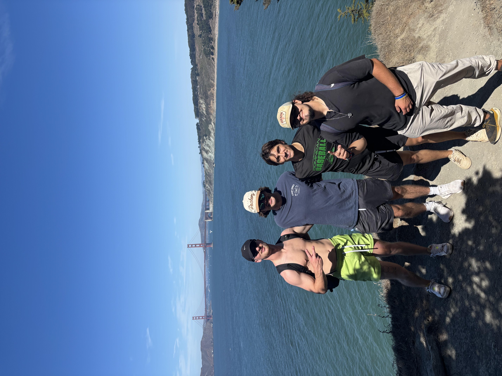
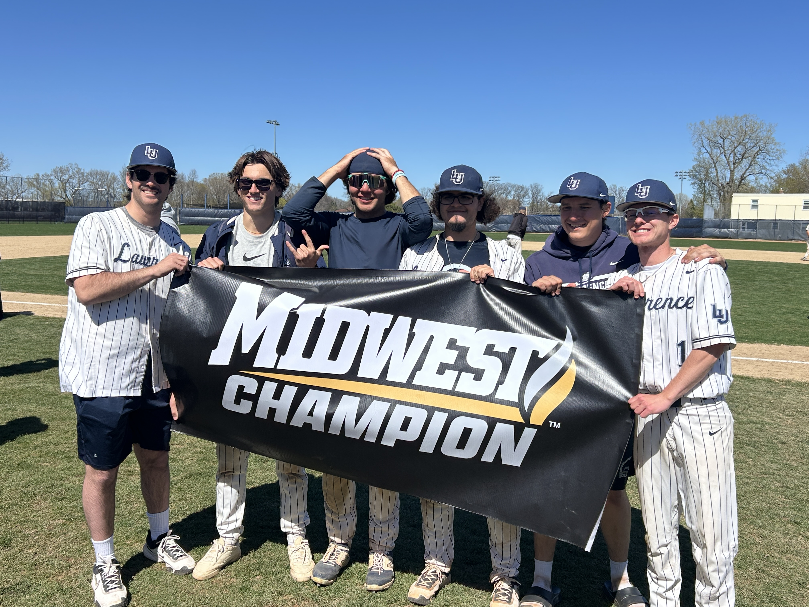
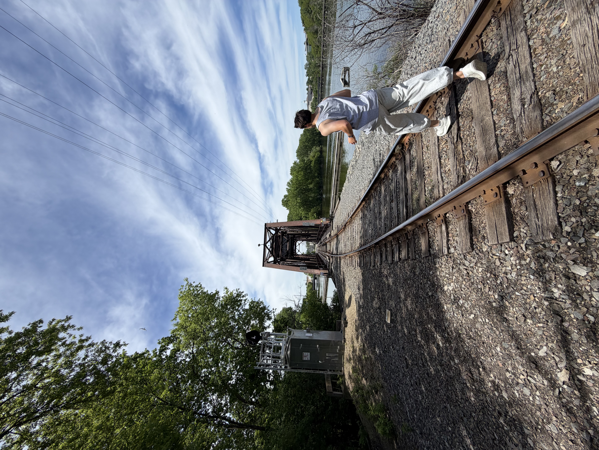

:::{#intro-heading}
## Conner Joseph Robertson

**Education**

High School Diploma | [Dominican High School](https://dominicanhighschool.com/)

BA in [Business & Entrepreneurship](https://www.lawrence.edu/academics/college/business-and-entrepreneurship) and [Data Science](https://www.lawrence.edu/academics/college/statistics-and-data-science)

2026 | [Lawrence University](https://www.lawrence.edu/)

**Interests**

Sports Analytics • Baseball Player Development • Programming

**Languages**

R • Quarto • Shiny • SQL

Github Repo for this Site 
<a href="https://github.com/connerrob24/connerrob24.github.io" target="_blank">
  <i class="bi bi-file-earmark-pdf-fill"></i>
</a>
:::

### Biography

Hello, I’m Conner Robertson — a student-athlete on the Lawrence University Baseball team and aspiring data analyst in the field of baseball and sports analytics. The experiences that come with being a part of a collegiate baseball team has provided me with a foundation for developing time-management skills and exploring interests across many areas. Across my 3 seasons with Lawrence Baseball, our program secured two conference championships. Through this, I have learned that an individual's and a team's success is heavily dependent on being disciplined and doing the "little things," as we like to say. This simple phrase taught me that in everything you do, paying attention to the small, overlooked details and maintaining diligence in the mundane will help build toward the ultimate goal you strive for. Overall, this experience has established my greatest strengths, which I consistently apply to this day: accountability, leadership, and sincere dedication to my commitments. My work coaching younger athletes has further reinforced these values, teaching me to lead with clarity, support others’ development, and translate what I’ve learned as a player into guidance for others. Overall, the world of sports performance and training greatly intrigues me, and I would love to translate my talents into pursuing a career path in this discipline one day. As a final note, something I hold in high regard is that I find myself greatly inspired by the people around me. Whether that be friends, family member, or even professors, I believe that continuously seeking those who will hold you to the highest standard is an unappreciated, or rather, under-stated value in life.

---

::: {layout-ncol=3 layout-valign="bottom"}

{style="width: 100%; height: 400px; object-fit: cover; border-radius: 15px;"}

{style="width: 100%; height: 400px; object-fit: cover; border-radius: 15px;"}

{style="width: 100%; height: 400px; object-fit: cover; border-radius: 15px;"}
:::

### Personal 

One thing that people tend to be surprised by when they first meet me is how many places I have lived in my life. I grew up in Danville, a suburban town about an hour outside of San Francisco. Once I turned 5, my parents decided to move my brother and I to a far and away place called Singapore, or at least that's how it felt at the time. We only lived there for a few years, but that experience has greatly impacted my outlook on life. I truly cannot overstate how much I have and will continue to appreciate that experience. To get to experience living in another culture at such a young age is a true priviledge that I pray I never overlook. Anyways, for the next 6 years we moved back to a different part of San Francisco, and eventually set out to Milwaukee when I began going into High School. Which is where we have been to this day. Quick sidenote, I always find it funny how difficult it is to explain somewhat of a simple question of "where are you from". 

Moving on to my personal interests, I love to cook. It may sound crazy, but I would like to one day work in a kitchen. Cooking for my family members when I am back home is my favorite way of sharing love and appreciation. Outside of cooking, you could say I am quite the competitive individual. I really enjoy playing a variety of sports with others. However, now that my baseball career is over, I may have to find something new to give so much of my time and effort. I also am big into running, lifting, and anything that comes with physical activity. Which leads me into how I also love the outdoors; hikes, biking, kayaking, you name it. That comes with photographing anything and everything that seeks my attention.

