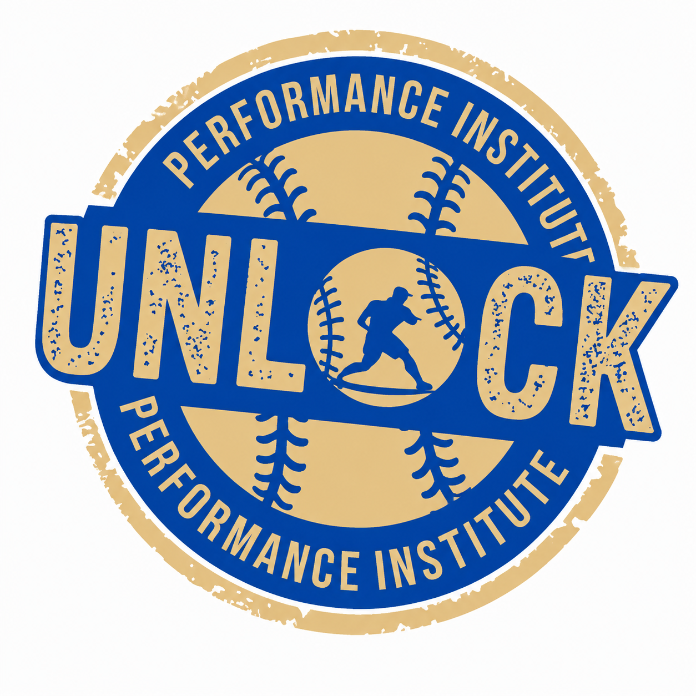

[Full PDF Document](https://drive.google.com/file/d/1OtXaL1Pi-Lp6udJg5Dxmf-ESdz1Bic1B/view?usp=sharing)

::: {.callout-note}
## About this project

This was a joint project worked on with Nico Manzanera, and Daniel Hawkins! 
<a href="https://drive.google.com/file/d/1qhlG-pVfZt8YlPswXpDgBZ-bsi_SdRPF/view?usp=sharing" target="_blank">
  <i class="bi bi-file-earmark-pdf-fill"></i>
</a>
:::

::: {.card}
## Executive Summary 

- Unlock Performance Institute is a technology-driven baseball training company focused on advanced pitching development for high school and collegiate athletes.

- UPI was created to fill a gap in amateur baseball training, especially for athletes and Division III programs that often lack access to professional-level resources, structured programming, and advanced performance technology.

- The business combines individualized training plans, pitching analytics, strength development, arm care, and remote coaching to help athletes improve performance while reducing injury risk.
:::

## External Market Analysis

### Business Implications

UPI must build genuine, long-term relationships with athletes, coaches, and parents. The business depends on trust, measurable results, and a training environment that athletes believe will help them improve.

UPI must also maintain consistent program quality, keep up with industry advancements, and retain athletes by regularly updating training systems and staying connected with its community.

### Key Leverage Point

*UPI can use seasonality as an advantage rather than a weakness*

During the baseball season, many competitors experience lower training demand. UPI can use this time to improve programming, build relationships, run clinics, and prepare athletes for off-season development.

### Sustainable Competitive Advantage

UPI’s strongest competitive advantage is its detailed integration of advanced technology with individualized pitching development.

By using tools such as Trackman, Rapsodo, Driveline, and Arm Care, UPI can provide data-driven training that is more specific and measurable than traditional coaching.

## Financial Analysis & Plan

UPI’s financial plan focuses on securing enough startup funding to launch the facility, purchase necessary equipment, and create a strong foundation for long-term growth.

::: {.grid}

::: {.g-col-3}
::: {.card .stat-card}
### $275,000

Startup financing needed
:::
:::

::: {.g-col-3}
::: {.card .stat-card}
### $157,500

Projected Year 1 revenue
:::
:::

::: {.g-col-3}
::: {.card .stat-card}
### $337,625

Projected Year 2 revenue
:::
:::

::: {.g-col-3}
::: {.card .stat-card}
### $651,500

Projected Year 3 revenue
:::
:::

:::

---

The first year is expected to involve heavy reinvestment and lower profitability because of startup costs. However, by years two and three, UPI expects stronger cash flow as the client base grows, services expand, and the business becomes more established.

A few key financial indicators support the company’s long-term potential. UPI projects an average gross profit margin of 49%, an average return on assets of 21%, and an average return on equity of 38% over the first three years.

The main financial priority is managing cash effectively. As the business grows, extra cash should be reinvested into equipment, technology, facility improvements, marketing, or investor returns.
