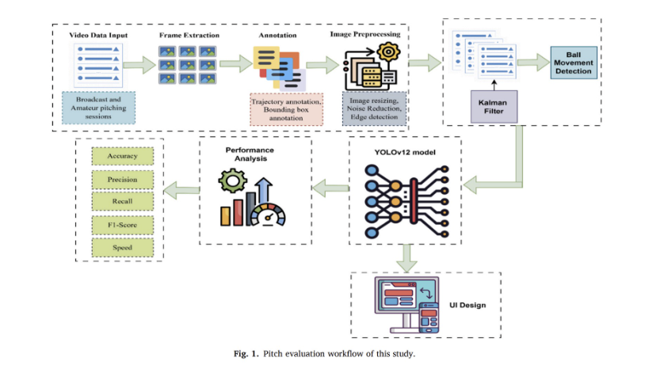
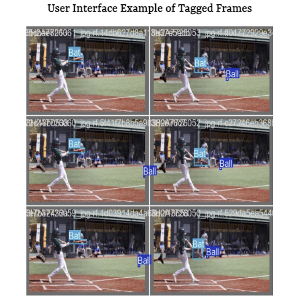

::: {.callout-note}
This was a joint project worked on with Nick Katz.

:::

::: {.poster-hero}

[View Poster](http://rpubs.com/nickkatz625/1437798){.btn .btn-primary}
:::

---

::: {.grid .article-top}

::: {.g-col-4}
::: {.article-title-box}
### Article Reviewed

**KFYO: Fusing vision and biomechanics for accurate pitch evaluation in real-time baseball using deep learning techniques**
:::
:::

::: {.g-col-8}
::: {.research-hero}
### Making Baseball Tracking More Accessible

This article explores how machine learning can be used to detect and track baseballs from video. Instead of relying only on expensive professional tracking systems, the researchers investigate whether computer vision models can help make pitch tracking more affordable and available to more players and coaches.
:::
:::

:::

---

## Article Snapshot

::: {.grid}

::: {.g-col-4}
::: {.card}
### Main Problem

Professional baseball tracking systems are powerful, but they are often expensive and difficult for amateur athletes, coaches, and smaller programs to access. To counteract the difficulty behind tracking a baseball; it is small, moves at high speeds, and often blurs on camera, researched decided to utilize deep learning.
:::
:::

::: {.g-col-4}
::: {.card}
### Data 

The data used included baseball videos collected from several sources, including professional highlights, amateur games, and self-recorded training footage. They then converted these videos into still frames so the model could learn from individual images. 
:::
:::

::: {.g-col-4}
::: {.card}
### Objective

To create a model capable of analyzing video without a multi-camera system (ideally, any regular video) and, from that video, reconstruct ball speed, trajectory, and rotation. More specifically, to detect small, fast-moving objects in real-time video using their newest model. Finally, to provide a low-cost, scalable alternative to commercial baseball tracking systems for training and performance analysis.

:::
:::

:::

---

## Methodology Breakdown

::: {.panel-tabset}

### Workflow Overview

::: {.text-center}
{style="width: 90%; border-radius: 15px;"}
:::

This workflow shows the full pitch-evaluation pipeline used in the study. The process begins with video data, breaks the video into frames, identifies and labels the baseball and bat, applies image preprocessing, and then uses the YOLOv12 model and Kalman filter to support ball movement detection.

### YOLO deep learning system

::: {.text-center}
{style="width: 50%; height: 700px; object-fit: cover; border-radius: 15px;"}
:::

Yolo, or “you only look once,” is an object detection model that scans an image once and predicts two things: where an object is located and what the object is (its category). Essentially, it takes a frame and identifies that something is a baseball and where that baseball is located in the frame.

*In this article, the researchers specifically implement the YOLOv12 model, which is a newer version of the YOLO framework*

### Kalman Filter Tracking

::: {.kalman-ascii}
```{=html}
<pre>
Frame 1        Frame 2        Frame 3        Frame 4
  ●  -------->   ●  -------->   ?  -------->   ●
detected      detected       missed       predicted
</pre>
```
:::

The Kalman filter helps track the baseball after it has been detected in individual video frames. Since the ball moves quickly and can become blurry, YOLO may not identify it perfectly in every frame.

It uses the ball’s previous position and movement to estimate where it should appear next. To be more specific, the filter tracks four variables: the ball's horizontal position, vertical position, horizontal velocity, and vertical velocity. It takes the object's (ball's) position and velocity in a given image and uses those metrics to predict where that object should be in the next frame.

::: {.callout-note}
## Why this matters

As explained, the ball can be difficult to detect in regular video. The Kalman filter thus helps fill in the gaps where it may be less clear in the frame by predicting the ball’s location when detection is uncertain.
:::

:::

---

## Limitations & Future Work

While the system was shown to have relatively strong performance (especially compared to previous models), several important limitations remain that the writers recommend be improved. One primary issue is the data imbalance: the model has more bat examples than ball examples. This is, of course, due to the nature of a baseball movement in the game, making it more difficult for the model to detect relative to the bat. With that, the ball-class recall for the system was 80%, meaning the model missed about 1 in 5 baseballs. They state that this misclassification happened most often when the ball was blurred or surrounded by background clutter.

The other primary limitation was that the Kalman filter assumed a mostly constant velocity for the baseball's motion, whereas in reality, it is affected by a multitude of real-world forces. They essentially somewhat simplified the physicis behind this movement. They state that this may potentially limit long-range trajectory prediction accuracy.Magnus forces, including gravity, drag, spin, and deceleration are a few of the forces that could be added with greater depth and specificty to increase the accuracy of the model's trajectory predictions.

Lastly, there were internal camera assumptions that somewhat limited videos would and wouldn't be accurate. The speed estimates relied on a standard 18.4 m pitcher-to-catcher distance and a mostly frontal camera angle, which may not hold in amateur videos.


