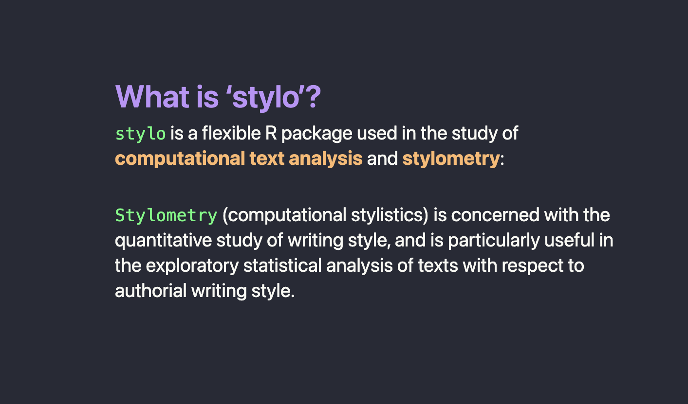
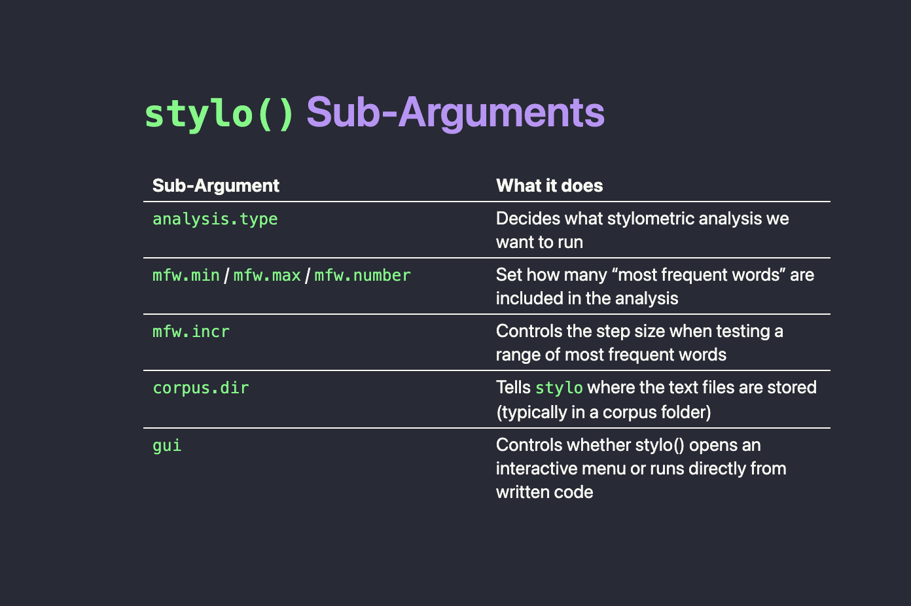
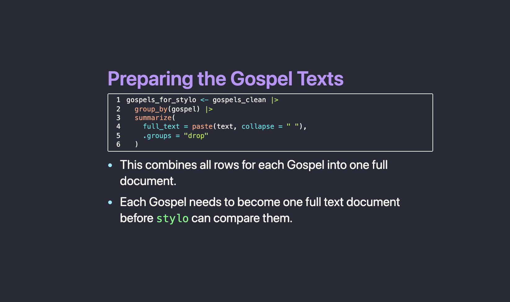
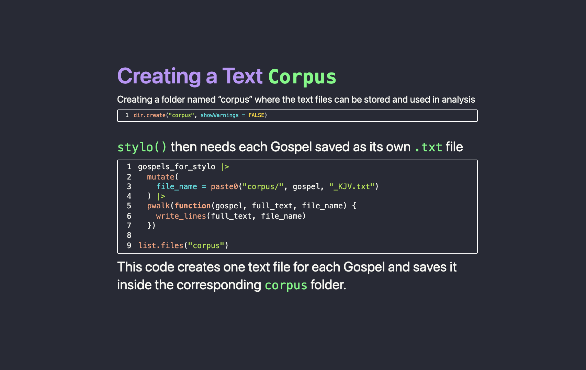
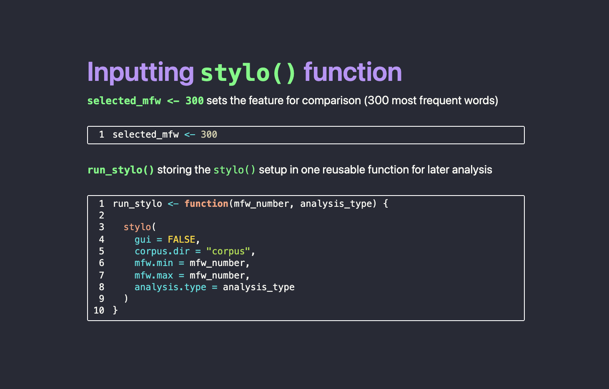
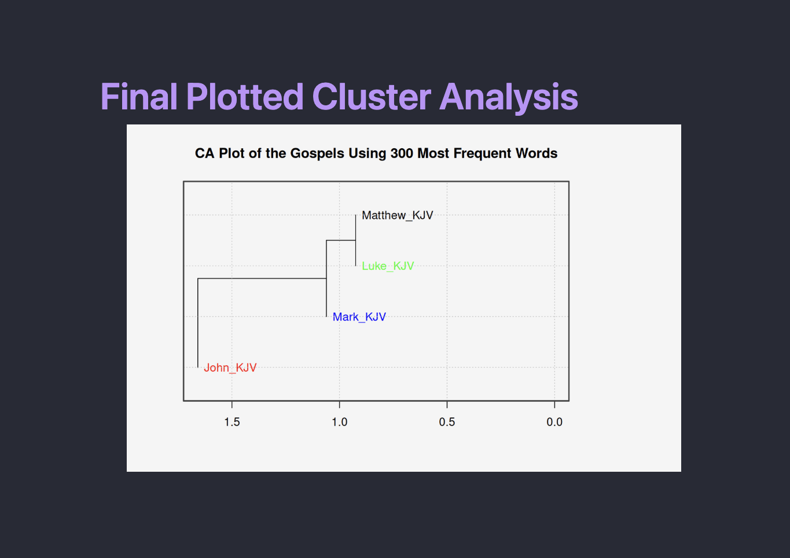

<i class="bi bi-box-arrow-up-right"></i>
<a href="http://rpubs.com/connerrob24/1431864">View RPubs Presentation</a>

::: {.presentation-intro}
This page highlights my package presentation on `stylo`, an R package used for computational text analysis and stylometry. The presentation walks through what `stylo` does, how text data must be prepared, and how the final cluster analysis can be interpreted. Primarily, stylo is exceedingly useful in the study of quantitatively comparing the authorial writing styles between authorship. In this example, the four Gospels were used to analyze the linguistic differences between the authors Matthew, Mark, John, and Luke.
:::

---

::: {.panel-tabset}

## What is `stylo`?

## `stylo` arguments

:::

::: {.slide-text}
### Preparing the Texts

Before running the analysis, the Gospel texts need to be cleaned and combined so that each Gospel becomes one complete document. This step prepares the data for comparison. The cleaned texts then need to be saved into a `corpus` foler. This allows the `stylo()` function to read text files from the corpus directory when running the final analysis.

::::

::: {.panel-tabset}

## Prepping Gospel Texts

## Creating Corpus Folder

:::

::: {.slide-text}
### Running `stylo()`

*Next, inputting the criteria for each argument in this example*

::::

:::: {.slide-showcase}
::: {.slide-image}

:::

::: {.slide-text}
### Step 5: Final Cluster Analysis

---

The visualization below is a cluster analysis plot, which works like a family tree of textual similarity.
Texts that connect on shorter branches are more similar to one another, while texts that
connect farther away are more distant in text patterning. To be more specific, the x-axis shows
relative Euclidean distances, which represent stylistic similarity (lower values indicate greater
similarity; higher values indicate greater dissimilarity). 

For a deeper analysis, view our [full workflow](https://drive.google.com/file/d/1N7kFC9q3tKnOqyLSO3LXhZtbjc_K8R5H/view?usp=sharing)

---

:::
::::