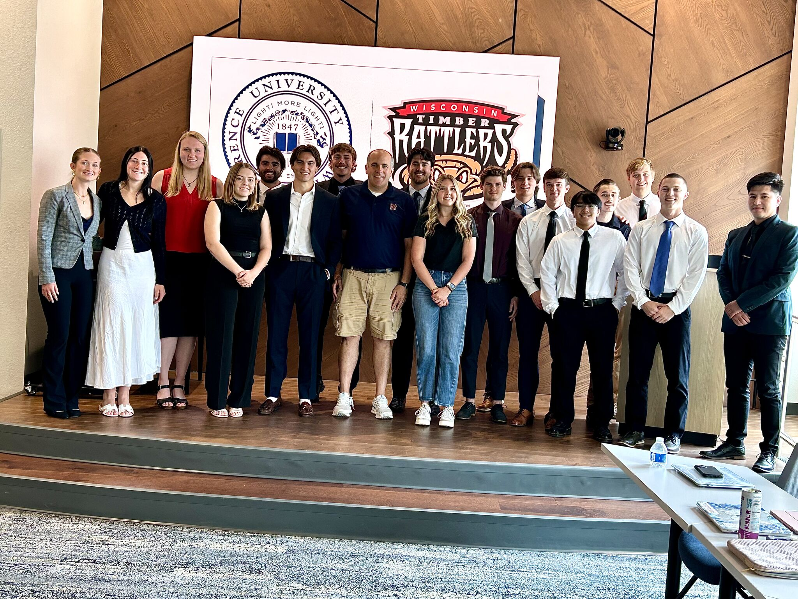

## Timber Rattlers Practicum Work

**Executive Summary**

This market research paper outlines comprehensive strategies aimed at increasing
engagement, visibility, and overall fandom for the Wisconsin Timber Rattlers, focusing on
sports marketing innovation, digital outreach, and new College Night initiatives. Drawing
from extensive social media analytics, national sports marketing trends, and primary
survey research, our goal is to modernize how the team connects with key demographics.

By aligning digital content with fan behavior, activating cause-based and community-
driven sponsorships, and creating personalized experiences for Gen Z fans, the Timber
Rattlers can position themselves as a modern minor league team that fosters loyalty,
inclusivity, and excitement. These efforts offer more than short-term attendance boosts—
they lay the groundwork for a new generation of lifelong fans.

Social media analysis across TikTok, Instagram, Facebook, and Twitter reveals several
trends. Player and Marketing-focused content consistently drives the highest
engagement, particularly when posted on weekends and throughout in-season months.
TikTok and Reels thrive on trend participation and player personality, while Facebook and
Twitter see deeper fan interaction through video content and community-based content.
Strategic timing, content format, and cross-platform recycling are a few important steps
for growing reach and sustaining fan engagement.

Survey research conducted among Lawrence University students supports a strong
interest in the return of College Night, particularly if events are hosted in May and early
June. The main barriers - academic conflicts, transportation, and lack of peer presence -
can be addressed through thoughtful planning, including school-provided shuttles,
student ambassadors, and themed programming. Respondents expressed clear interest in
affordable pricing, interactive games, free merch, and school-specific celebrations.

View Our Final Report! [PDF Document](https://drive.google.com/file/d/1c04c7N2KtxSGbbG6O84baMcKsqir85wL/view?usp=sharing)

{.tr-project-card}

